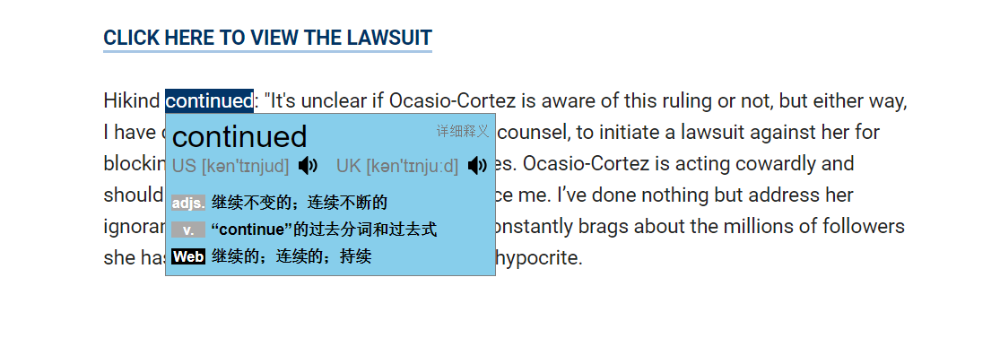
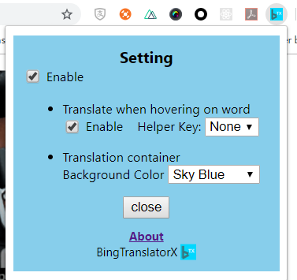

# BingTraslatorX

A Chrome extension for Chiese-English/English-Chinese translating. Support mouse hovering and selection.

基于必应词典的中英互译, 支持鼠标悬浮取词、英美音标和发音。如果你喜欢必应词典，不要错过哦! 😊

## 截屏示例

- 单击或者选中取词
  

* 鼠标悬浮取词
  

- 支持中翻英

  

* 选项

  

## Bug Report

- 📧: hailengc@gmail.com
- [Create an issue](https://github.com/hailengc/BingTranslatorX/issues)

## Thanks

- Animation icon [Ellipsis](https://loading.io/spinner/custom/279251/) is provided by loading.io
