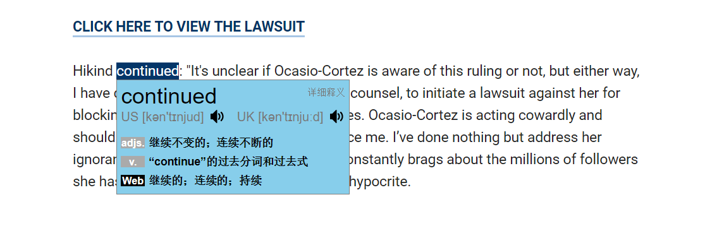
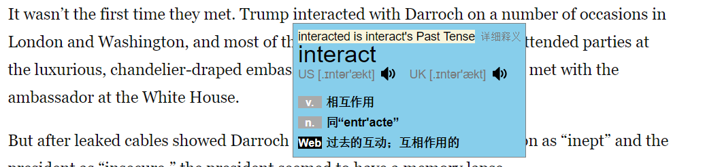
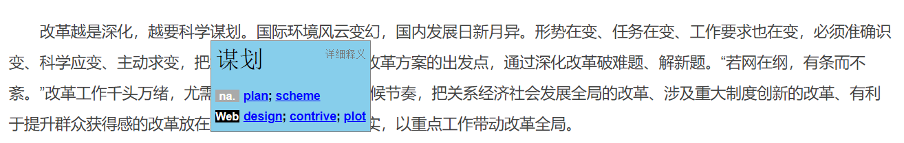
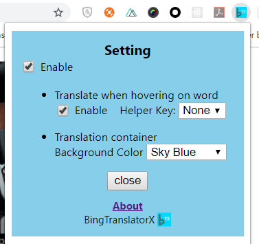

# BingTranslatorX

基于必应词典的中英互译, 支持鼠标选中/悬浮取词、英美音标及发音。基于 https://www.bing.com/dict 。

A Chrome extension for Chinese-English/English-Chinese translating. Support mouse hovering and selection.Based on https://www.bing.com/dict.

## 安装 ( Installation )

* Chrome web store:  https://chromewebstore.google.com/detail/bingtranslatorx/jjeahpiblnooclghjhjmcdhlmmfpdjkh
* Edge add-on: https://microsoftedge.microsoft.com/addons/detail/bingtranslatorx/cdhfjnkkjbdaoogiifeajdomiiepijai
  

## 报告Bug或建议 (Bug Report or feedback)

- [报告Bug或者提交建议](https://github.com/hailengc/BingTranslatorX/issues)
- Emaail to developer: hailengc@gmail.com

## 截屏示例 (Screenshots)

- 选中取词 (Select Word)
  

* 鼠标悬浮取词 (Hover on Word)
  

- 支持中翻英 (Supports Chinese to English)

  

* 选项 (Setting)

  

## 感谢 (Thanks)

- Animation icon [Ellipsis](https://loading.io/spinner/custom/279251/) is provided by loading.io
